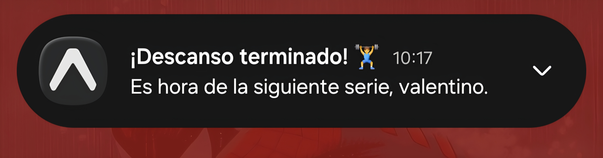
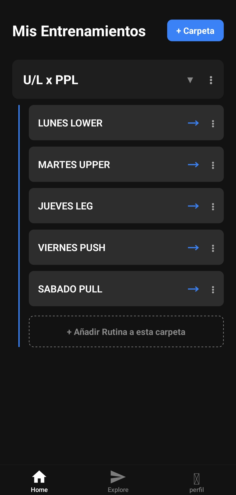
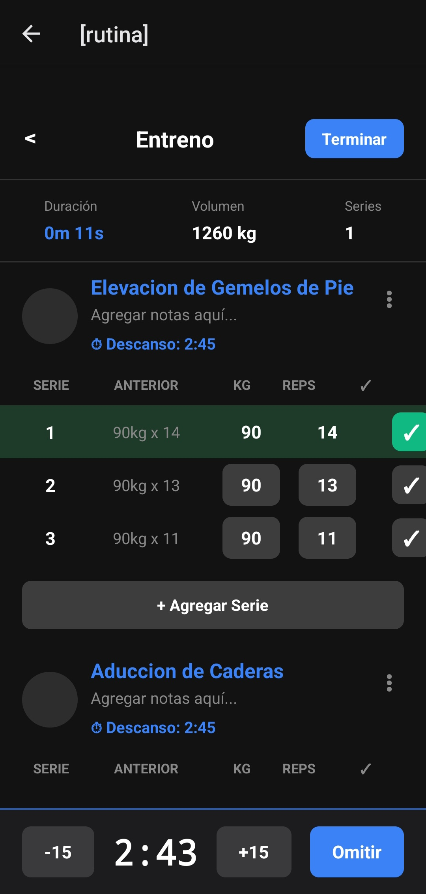
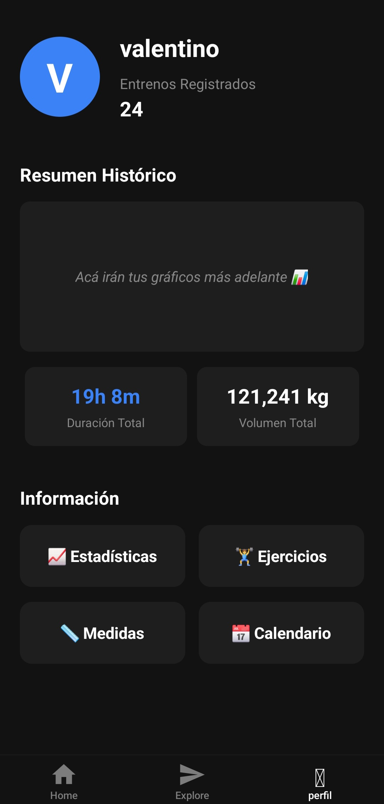

# Gym APP

Una aplicación móvil desarrollada en **React Native / Expo** pensada para registrar entrenamientos de fuerza, gestionar rutinas personalizadas y controlar los tiempos de descanso con precisión milimétrica, incluso en segundo plano.

## Características Principales

- **Cronómetros Nativos Infalibles:** Integración con `expo-notifications` para gestionar los tiempos de descanso usando `TIME_INTERVAL`, asegurando que la alarma suene siempre, sin importar las restricciones de batería de Android (Doze Mode).
- **Gestión de Rutinas y Ejercicios:** Creación, edición y eliminación de rutinas. Opción de agregar ejercicios personalizados con fotos desde la galería de tu teléfono.
- **Persistencia de Datos Local:** Uso extensivo de `AsyncStorage` para guardar el historial de entrenamientos, progreso, volumen total y configuraciones del usuario sin necesidad de internet.
- **Interfaz Dinámica e Intuitiva:** Listas reordenables (Drag & Drop), animaciones de "Swipe to delete" y un perfil dinámico que saluda al usuario por su nombre.

## Tecnologías Utilizadas

- **Framework:** React Native / Expo
- **Lenguaje:** TypeScript
- **Almacenamiento:** AsyncStorage (Local Storage)
- **Librerías Clave:** \* `expo-notifications` (Manejo de alertas nativas)
  - `expo-image-picker` (Acceso a galería)
  - `react-native-draggable-flatlist` (Reordenamiento de listas)

## Capturas de Pantalla

|                    Inicio & Rutinas                     |                     Cronómetro Activo                      |                     Perfil del Atleta                     |
| :-----------------------------------------------------: | :--------------------------------------------------------: | :-------------------------------------------------------: |
|  |  |  |

## Tecnologías Utilizadas

- **Framework:** React Native / Expo
- **Lenguaje:** TypeScript
- **Almacenamiento:** AsyncStorage (Local Storage)
- **Librerías Clave:** \* `expo-notifications` (Manejo de alertas nativas)
  - `expo-image-picker` (Acceso a galería)
  - `react-native-draggable-flatlist` (Reordenamiento)

## Cómo ejecutar el proyecto localmente

Si querés clonar este proyecto y probarlo en tu máquina:

1. Cloná el repositorio:
   \`\`\`bash
   git clone https://github.com/vxlentino/gym-tracker-app.git
   \`\`\`
2. Instalá las dependencias:
   \`\`\`bash
   npm install
   \`\`\`
3. Iniciá el servidor de Expo:
   \`\`\`bash
   npx expo start -c
   \`\`\`
4. Escaneá el código QR con **Expo Go** en tu celular.

## 👨‍💻 Autor

**Valentino** Estudiante de Tecnicatura en Programación / Desarrollo de Software.

- GitHub: [@vxlentino](https://github.com/vxlentino)
